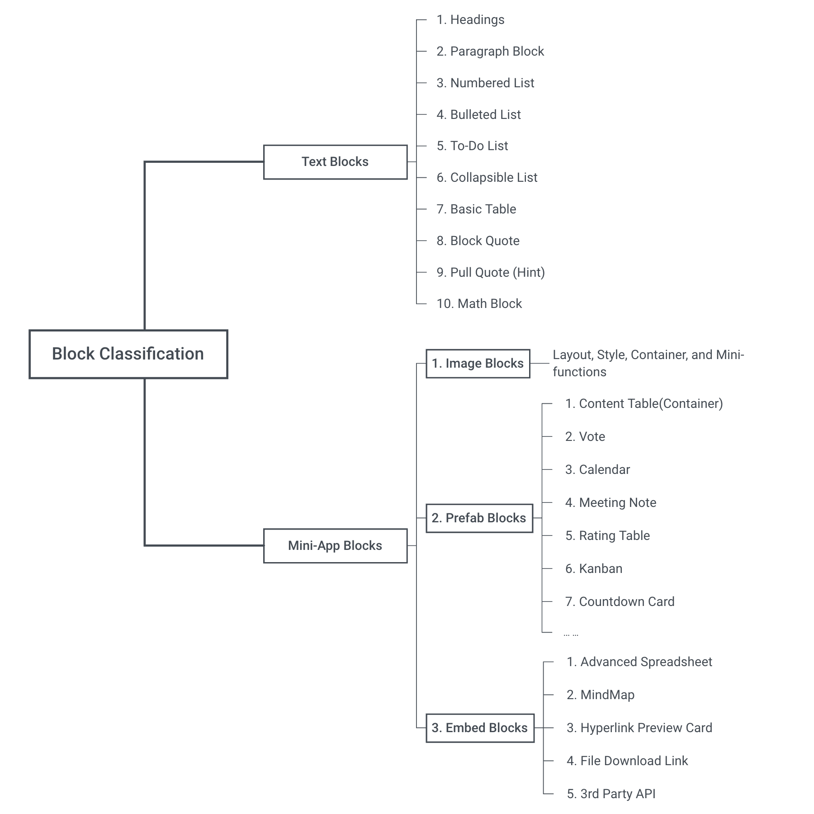
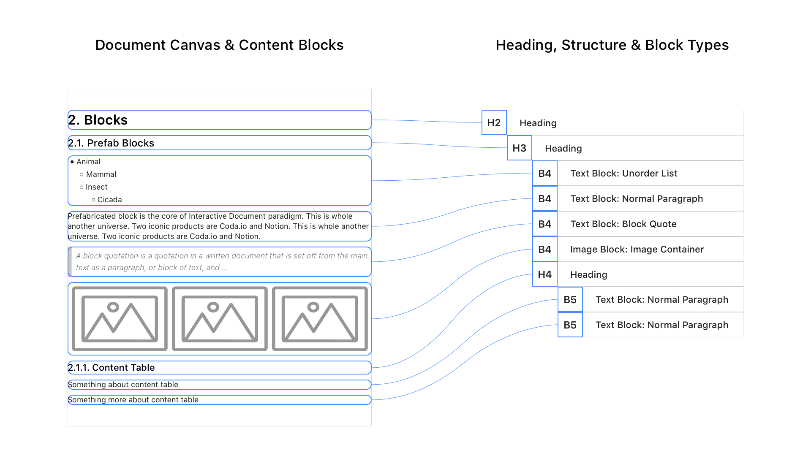
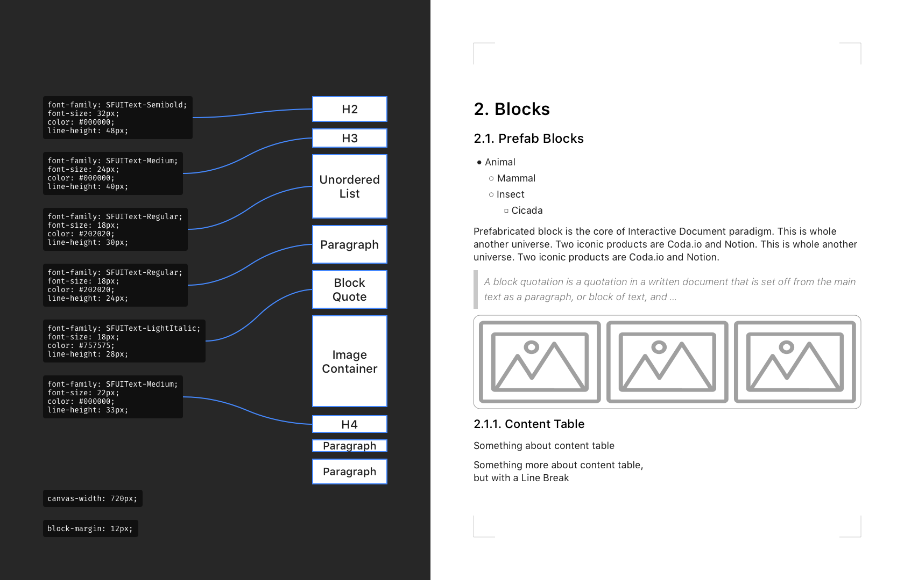

# Block Style Editor (EN)

A Playbook for Block Style Editor (**BSE**): Text Styling, Block Components, Misc Functions & Theme Switcher 

`Block Style Editor`;`Block Structure Editor`; `New-Gen Editor`; `WYSIWYG Markdown Editor`; `Modular Visual Components`; `Structured Content`; `Web-based Text Editor`; `Rich Content Editor`; `CMS`; 

---

## About Block-Style Editor

### Definition

- **Background of Block-Style Editor：**

  - Markdown, for its high readability and simple syntax, has been adopted widely; Pure Markdown editing is [WYSIWYM](https://en.wikipedia.org/wiki/WYSIWYM)
  - Most Web-based RTF editors follow [WYSIWYG](https://en.wikipedia.org/wiki/WYSIWYG) interaction pattern
  - Block Style Editors provide a Markdown-like but WYSIWYG editing experience
  - On UX and interaction level, BSE provides a similar experience to [Typora](https://typora.io/), [MarkText](https://marktext.app/), but with integrated Mini-App Blocks

- **Features of Block-Style Editor：**

  - Follow a structure of **[ Markdown (Template) + CSS + Fonts ]**
  - Inherent the **text styling rules** of Markdown, keep its simplicity and content-focusing approach; Remove features like: line spacing, font size, font color
  - Expand text editing into **Text Editing & Styling** and **Mini-App Customization**
  - Mini-App Blocks: table, image container, advanced code block, prefabricated UI view, embeds.  
  - **A web-based Content Editor** that, take **Interactive Document** and **Modular UI** as guideline, use **Block / Paragraph** as content unit, use **Markdown** as its Template Structure. 

  

> Block-Style Editor has its roots in CMS(content management system), SSG (static site generator), GitHub& Markdown, MDX, JSX, and Low-code Site Building. 
>
> In a sense, a Block Style Editor is a Modular CMS for web document use case.

### Block Type Classification

### UI Structure of Block-Style Editor

### Content-Heading-Block Structure

#### Example Style & CSS

