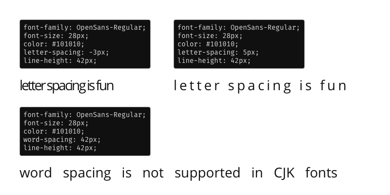
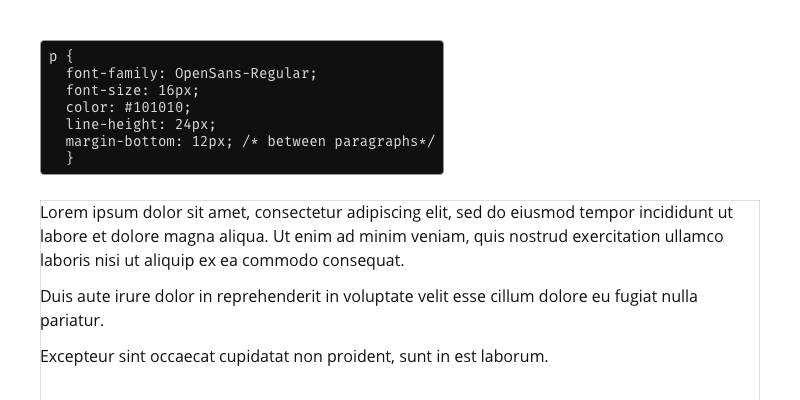
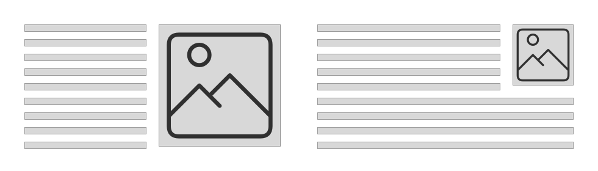
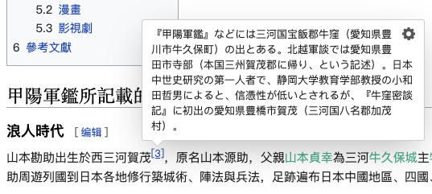
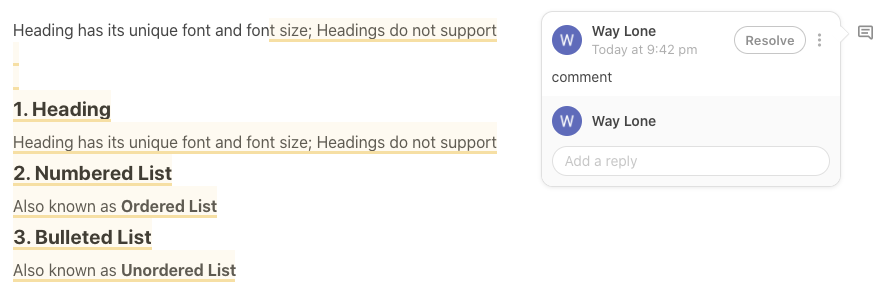

A **Text Block** is the most used and most common block in a **BSE**. Its styling rules largely inherent from common **WYSIWYG Markdown Editors**. 

**Inline** and **Block** are actually HTML concepts for **inline elements** and **block elements** [^[W3School]^](https://www.w3schools.com/html/html_blocks.asp).  Here, we take the concept to UX/UI level, emphasizing on their visual and interaction properties.   

## Inline Text Style

We expect most below Styles/Effects can stack upon each other, like **Bold** + *Italic* + <u>Underline</u> + ~~Strikethrough~~ = <u>***~~Stacked Style~~***</u>

There are some exceptions,  like `Inline code` + ==Highlight== 

### 1. Bold

### 2. Italic

### 3. Underline

### 4. Strikethrough

### 5. Highlight

### 6. Inline Code

### 7. Tag / Keyword ⭐️

Has similarity with **Inline Code** on visual level, but different on use case level. 

A further implementation would be adding a **Popover Card** on the **Keyword UI**.

### 8. Superscript & Subscript

### 9. Text Alignment

Not a Markdown supported style, but indeed a feature needed by many.

---

## Legacy Inline Text Style

Below are legacy **Office Styling Features** that I am trying to Kill 🗡🩸, with a **Universal Theme Switcher**.

In a modern web editing environment, these attributes are not supposed to be seem by users. 

### x.1. Font Color

### x.2. Font Background Color

### x.3. Font Family

### x.4. Font Size

### x.5. Letter-Spacing & Word Spacing



Word Spacing is not supported in CJK font

### x.6. Line Height & Paragraph Spacing

**Paragraph Spacing** is actually a design term, appearing in InDesign, Sketch, MS Word, etc.

In CSS,  `margin-bottom` is used to add spacing in-between paragraphs. There are many alternative ways to achieve this, depending on the dev-framework you use. 



### x.7. Indent

### x.8. Content Width / Line Width

### x.9. Inline Image

### x.10. Text-Image Wrapping

Another **Legacy Style** appears in Office product, graphic publications, and newspaper.  



---

## Inline Function

- Inline Function makes certain portion of the text **Intractable** ;

- Interactive Objects are attached on certain part of **Text**, instead of the whole **Text Block**;

- Ideally, the **UI height** does not exceed **line height**. 

### 1. Hyperlink

Simple outbound link to external pages. 

### 2. InDoc Link / Internal Link

[Internal Link](#### InDoc Link / Internal Link)

Direct to another paragraph of the current document

### 3. Mention @

### 4. Inline Icon ⭐️

- Able to upload and use customer **Image-based Icon** (not font icon)
- Give user option to turn an inline image into a inline Icon which has equal height as line height; or turn an inline image into image block

[Joypixels](https://www.joypixels.com/)

### 5. Terminology & Reference Popover Card ⭐️

**Wikipedia** reference popover card:

**Interaction Rules:** 

- Popover when mouse over highlighted field
- Retract if mouse move away
- Stay and become intractable if mouse move over



---

## Paragraph Block

### 1. Headings

- A Heading has its unique font and font size according to a set of theme; 
- Headings do not support some text styles, such as Bold, Highlight
- Collapsible Heading 

### 2. Numbered List

Also known as **Ordered List**

### 3. Bulleted List

Also known as **Unordered List**

### 4. To-Do List

Also known as **Task List** or **Check List**

### 5. Collapsible List

### 6. Basic Table

### 7. Block Quote

### 8. Pull Quote / Hint

**Pull quote** uses a bigger font size than traditional **block quote**; usually used to create a visual impact and an another way to highlight Text block. 

### 9. Basic Code Block

Simple Text Code Block: **Background Color**, **Mono Font**, **Syntax Highlighting**

```yaml
receipt:     Oz-Ware Purchase Invoice
date:        2012-08-06
customer:
    first_name:   Dorothy
    family_name:  Gale
```

### 10. Block Math

$$
E=mc^2
$$

### 11. Comment ⭐️

A commenting feature that can target multiple blocks and partial text from single text block.



### 12. Text Block Background ⭐️