---

## Image Block

Most used **Block Type**, has most variations. It always has been a pain to balance image and text, in term of how they eventually appear on the document. 

### 1. Basic Image

- Drag&Drop Upload to a specific Block/Paragraph
- Resize 
  - Quip offers a simple **Grid & Snap feature** for resizing images ⭐️
- Alignment: Left, Right, Center
- Border and Shadow
- Caption (title for the image)

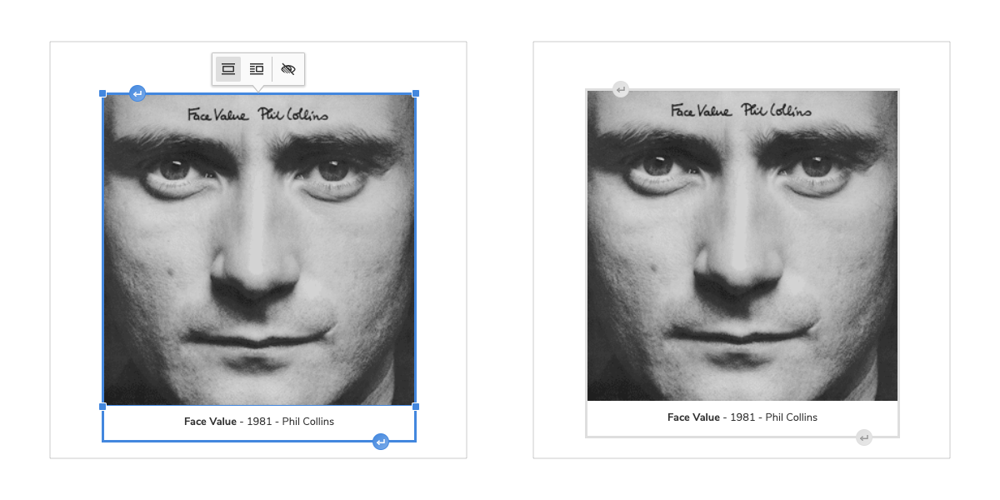

**CKEditor** - basic image function: Caption and Resize

### 2. Container

Instead of treating **Images** as **Inline Objects**, a Container System provides **Table - Image Object** structure

The idea of **Image Container** can be expanded to a **Visual Content Container** or **Content Table**. Further discussion at [Prefab Block](###-Prefab-Block)

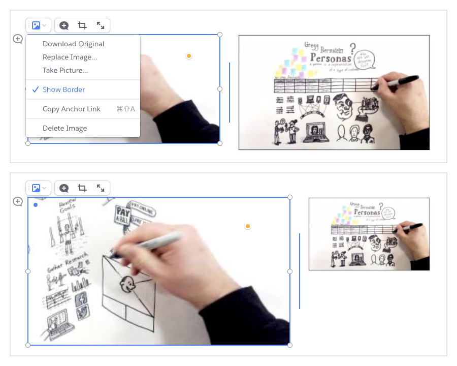

**Quip** image container with ==Grid and Auto-Snap feature==

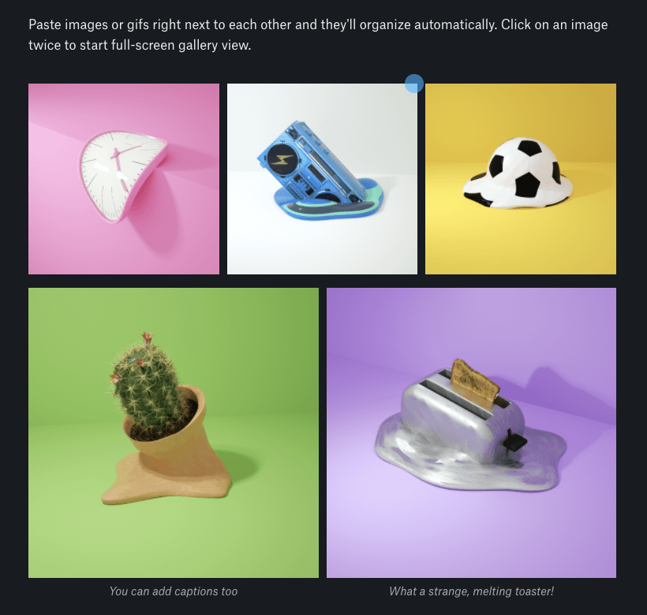

**Dropbox Paper**, auto grid - image gallery

### 3. Carousel

- A derivative of Container

- Suitable for CMS and Blog-ware, not exactly for tech document

### 4. Gallery

A derivative of Container

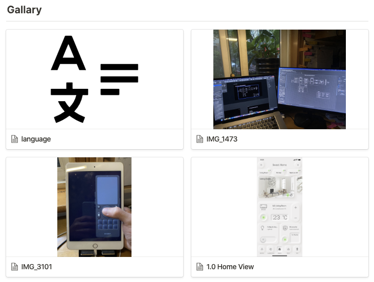

**Notion** - Image Gallery

### 5. Tab Image Switcher ⭐️

A derivative of **Container**, see Gitbook Tab Container

### 6. Commenting in Image

Comment dot in **Quip**'s image block

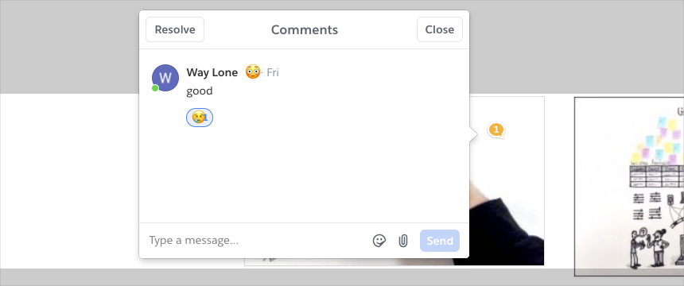

---

## Prefab Block

Prefabricated block is the core of **Interactive Document** paradigm. This is whole another universe. Two iconic products are [Coda.io](https://coda.io/) and [Notion](https://www.notion.so/).

> Coda has a bit of learning curve, even for tech-based users. Thus, I don't think it will have a large user base in the short term. Nonetheless, Coda is still a great product for its framework design and micro-interaction design. 

Below are some common types of **Use Case Driven** prefab blocks, that can be used in regular document systems.

### 1. Content Table (Content Container)⭐️

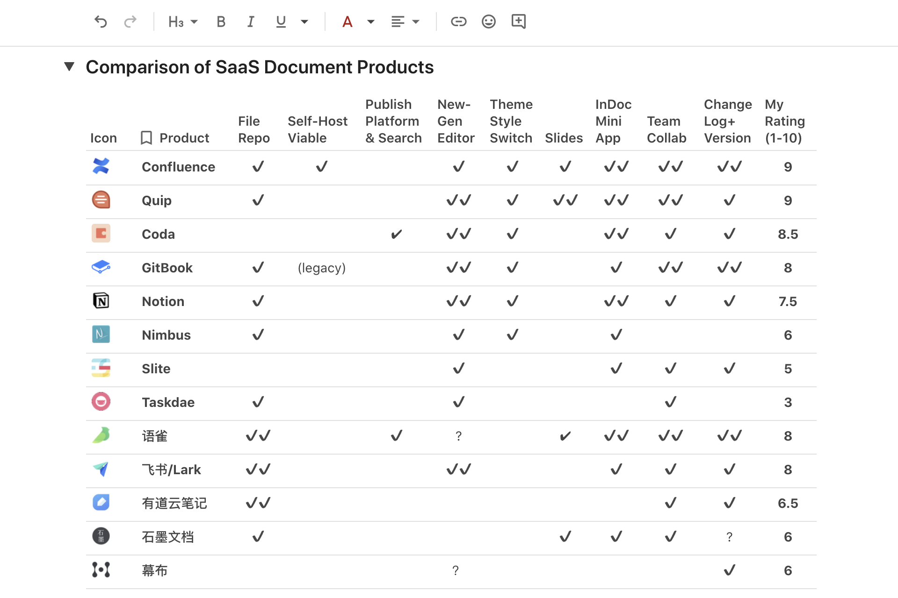

Coda Content Table

### 2. Advanced To-Do List

### 3. Vote

### 4. Calendar

### 5. Meeting Note

### 6. Rating Table

### 7. Kanban

### 8. Countdown

**Quip** countdown Card

---
 
## Embed Block

### 1. Advanced Spreadsheet

Microsoft Excel comparable spreadsheet and data-visualization product 

### 2. MindMap

### 3. Hyperlink Preview Card

A widely used feature in CMS, Blogs and other web pages. Not a suitable style for tech related document.

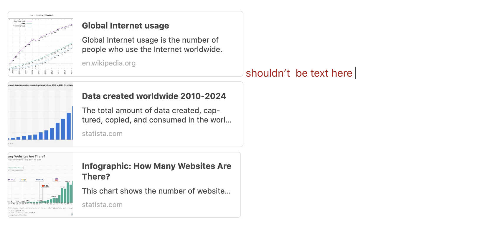

This is bad example by Coda. Coda treats a URL preview card as an **inline object**. Text can be applied to the same paragraph (block). To me, this leads to confusion and bad experience to users. 

A large Image, Card or other large visual object should be treat as a **paragraph (block) object**. 

### 4. File Download Link

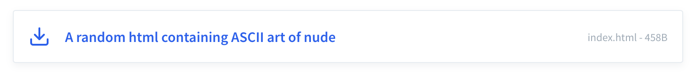

*Gitbook UI for file downloading link*

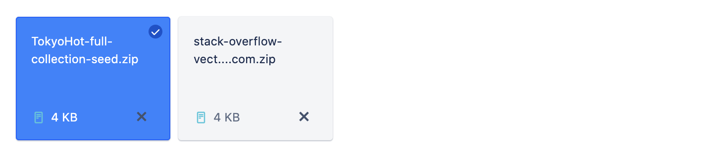

*Confluence UI for file downloading link*

### 5. 3rd Party API 

The process of deciding what API and external service to integrate is highly **Use Case Driven**.

List of common 3rd party API embeds:

1. Embeds from Image, Music, Video hosting service
2. Commenting, Rating, Stats service
3. Code Snippet Demo service: CodePen, JSFiddle
4. Graphic Design & UI Design hosting service 
5. Weather info, Location info, etc

---

## Miscellaneous Functions

### 1. Advanced Code Block

Code block from [Microsoft Docs](https://docs.microsoft.com/en-us/windows/uwp/design/basics/xaml-basics-adaptive-layout) - High Contrast Theme

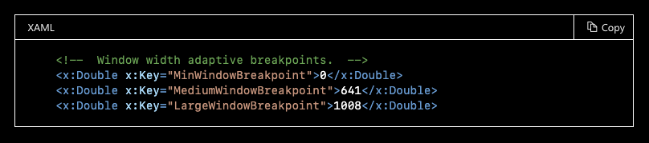

[Docsify](https://docsify.js.org/#/) Auto-Compile Multi-Tab 

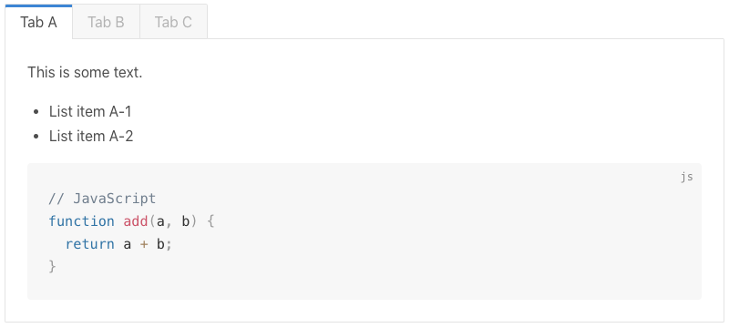

[Gitbook](https://app.gitbook.com/) Code Block with Multi-Tab

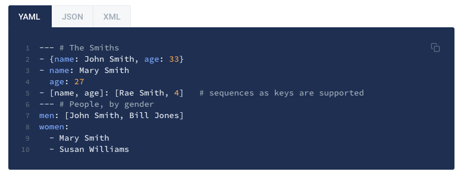

### 2. Collapsible Heading / Block

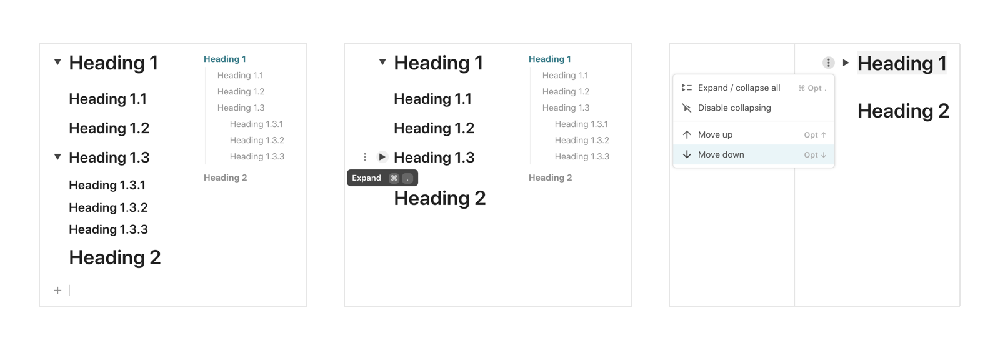

Coda collapsible heading (Block) feature

### 3. Ordering Blocks by Drag&Drop

A common function adoptable by some BSE products. Users can change a block's **position** and **hierarchy** by drag & drop. 

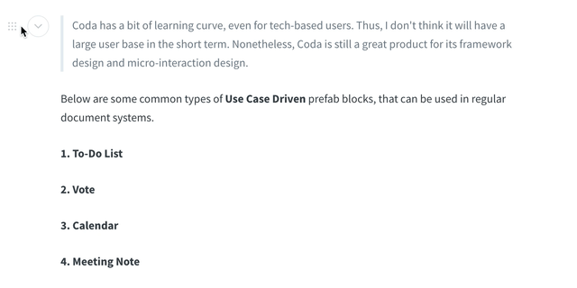

*Gitbook drag & drop block feature*

### 4. Comment

A commenting feature that can point to multiple blocks and partial text from single text block.

**Coda** - comment function

### 5. Structured List to MindMap ⭐️

K-Tree structure stored in XML, Markdown, HTML, or other XML-like languages, should be able to populate simple MindMaps. Such feature will allow user to create Mindmap in the simplest way possible. 

My illustration of **Structured List to Mindmap** function

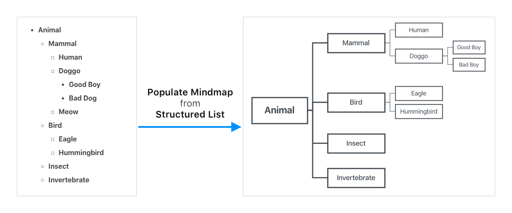

### 6. TOC to MindMap

https://markmap.js.org/repl/

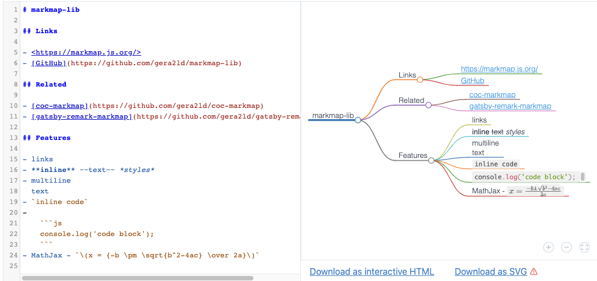

https://atom.io/packages/markdown-mindmap

An actual use case for **TOC-to-MindMap** feature

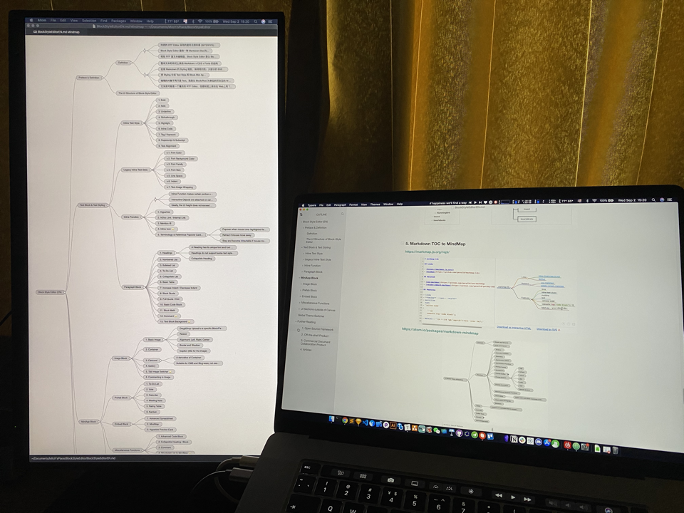

*Monitor on the left shows the TOC mindmap of this document*

### 7. Document Repo to MindMap (Knowledge Map)

Map out the entire document repository, by **Document Hierarchy**, **TOC**, **Terminology Card**, **Links**, etc.

This feature is used in **Research Focused** note taking and knowledge management tools, such as [Obsidian](https://obsidian.md/), [Roam Research](https://roamresearch.com/), [幕布](https://mubu.com/)

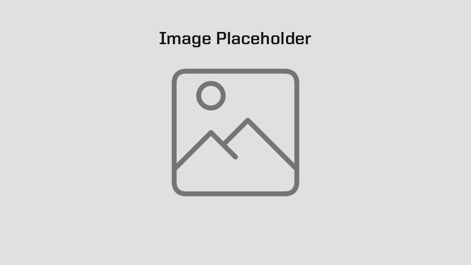

---

## Out of Canvas UIs

### 1. Floating TOC

### 2. File Tree

### 3. Comment Section (Community Feedback)

- **"Like - Follow - Watch"** stats
- Number of Comments
- Text highlighting by user
- ......

### 4. Authors & Contribution

### 5. Cover Image

### 6. Article Stats

- Word & Character Count
- Version Control & Editing History
- Suggested Reading Time
- Block Usage & Page Composition